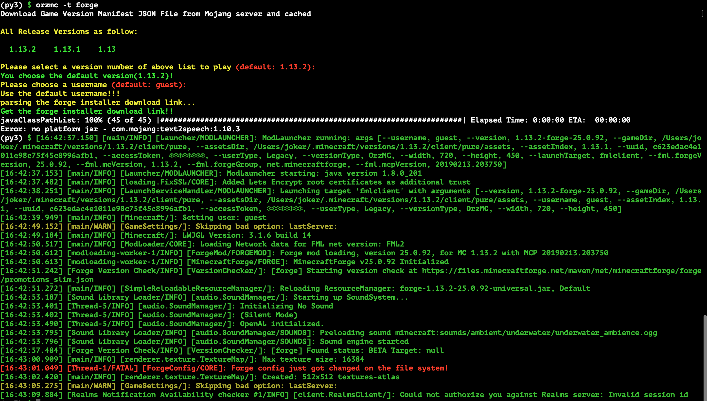
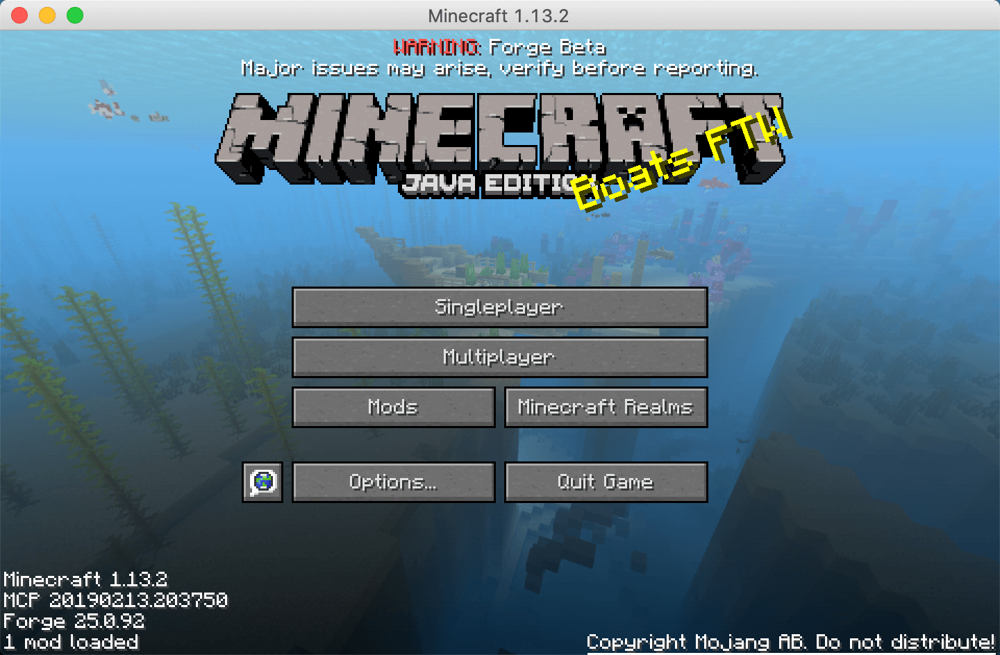

# OrzMC

A tool for deploying minecraft client and server

Only supports Python >=2.7, <4

Requires JDK 1.8 to be configured, not higher than this version, becuase forge cannot run on higher jdk versions such as 1.12!

# Introduction Video on YouTube(Need VPN in China)

- [[1]Minecraft 开服工具以及MacOS启动器支持1.13.2 OrzMC-1.0.22](https://youtu.be/uNDx__muBVY)

- [[2]Minecraft 开服工具以及MacOS启动器支持1.13.2 OrzMC-1.0.22](https://youtu.be/sC8xHHhgNC4)

# Supported Minecraft Client Version

- supports versions of client `>= 1.13`

- you should make sure the version of the minecraft server that you will connect to is the same as that of the client.

- This Program has been uploaded into PyPI

# Supported Operating System

- mainly for MacOS.
- If your operating system is Linux or windows, there is another launcher which is beautiful and flexable: [HMCL](https://hmcl.huangyuhui.net), you can use it play this game.

# Usage

`orzmc -h` to check the help info

```bash
$ orzmc -h

   NAME

        orzmc -- A command line tool for start minecraft client or deploy minecraft server

    Usage

        orzmc [-v client_version_number] [-u username] [-h]

            -s, --server
                deploy minecraft server, if there is no this flag, this command line tool start minecraft as default
        
            -v, --version  
                Specified the Minecraft clinet version number to start

            -u, --username 
                pick an username for player when start the client

            -t, --game_type
                Specified the type of game: "pure"/"spigot"/"forge" for server, "pure/forge" for client

            -m, --mem_min
                Specified the JVM initial memory allocation

            -x, --mem_max
                Specified the JVM max memory allocation

            -V, --Verbose
                Output some debug info for bugfix

            -h, --help 
                show the command usage info

            -f, --forceUpgrade
                when deploy spigot server, the option can upgrade your map from old game version

            -b, --backup
                backup your minecraft world into ~/minecraft_world_backup directory as zip file!
```

## Run Client

### run the pure client normally with latest version and default username

```bash
$ pip install orzmc
$ orzmc
```


### if you know the client version and your username

```bash
$ pip install orzmc
$ orzmc -v 1.14.2 -u player_name
```

### you can also run the forge client

```bash
$ pip install orzmc
$ orzmc -t forge
```





## Deploy Server

### use default setting to deploy the pure server

default set jvm initial memory alloc `512M`, and max memory alloc `2G`

```bash
$ pip install orzmc
$ orzmc -s
```

### you can specify the initial memory and max memory alloced for the jvm with options `-s` and `-x` to run the minecraft server

```bash
$ pip install orzmc
$ orzmc -s -m 512M -x 2G -v 1.14.2
```

### you can also deploy the spigot/forge minecraft server with option `-t`

#### Spigot Server

you should installed `jre` and `git` tools before you run commands below.

```bash
$ pip install orzmc
$ orzmc -s -t spigot -m 512M -x 1G -v 1.14.2
```

#### Forge Server

```bash
$ pip install orzmc
$ orzmc -s -t forge -m 512M -x 1G -v 1.14.2
```

由于Forge包是用JDK 8编译的，所以建安装的JDK环境为JDK8系统，不要太高，目前不兼容，会出现无法部署Forge服务器的情况。

---

The game resources are saved under user's home directory, and named `.minecraft`

# Tips

This is not a game for one player, so you should invit someone you like to make you guys own beautiful world!!!

# TODO List

- [ ] fire an weixin public account and group for uses get newest information and communicate with each other
- [ ] implement RCON Protocol for remote control Minecraft Server
- [ ] add world backup function
- [ ] refine the project script for readable
- [ ] automation the process of installing JDK/JRE Runtime
- [ ] add some unit test case to guarantee quality
- [ ] create a Docker Mojang Mirror Server for personal CDN 

# Done List

- [x] add Spigot Server deploy option
- [x] add a homepage for this project
- [x] support forge client and server on MacOS, Yep!!!🤪 
- [x] backup your world map files

# Reference

- [SpigotMC](https://www.spigotmc.org/)
- [Minecraft Forge](https://files.minecraftforge.net)
- [CurseForge](https://minecraft.curseforge.com)(最新版的相关资源下载的最好的地方)
- [Minecraft 中文资源站](http://www.minecraftxz.com)(老旧版的资源下载站，不需要翻墙)
- [Minecraft 中文百科](https://minecraft-zh.gamepedia.com/Minecraft_Wiki)
- [Minecraft 官方Wiki](https://minecraft.gamepedia.com/Minecraft_Wiki)
- [Minecraft 微软官方](https://www.minecraft.net/zh-hans/)
- [Minecraft 网易官方](http://mc.163.com)
- [Query协议](https://wiki.vg/Query)
- [RCON协议](https://wiki.vg/RCON)

# Tips 

- 制作资源包，压缩是要在assets同级目录选择所有文件，而不是在父目录下压缩
- 使用query协议查询服务器状态需要用到UDP协议，所以在云服务器上部署需要允许这个协议访问对应的端口

# 关于Mac上玩时，无线网络总是断开重连的总题解决方案

网络设置，编辑位置，随便编写个名字，然后高级，里面选择DHCP续租，完成，就不会掉线了。

# 测试你的服务器可以支持几个玩家同时在线

安装服务器网速测试工具`speedtest-cli`, 并测速:

```bash
$ pip install speedtest-cli
$ speedtest-cli
```

将得到的上下行网速填入下面网址对应页面的区域时, 并将服务器的内存大小也填入, 开始计算即可

[测试网址](http://canihostaminecraftserver.com)

# Spigot服务器支持将低版本游戏的地图更新到新版本

只需要在启动命令中添加 `--forceUpgrade` 选项，启动一次服务器地图更新后，启动服务器就不需要添加这个选项了。

Spigot的地图文件有三个目录：

- `world` 对应纯净服的主世界地图目录: `world`
- `world_nether` 对应纯净服的下界地图： `world/DIM-1`
- `world_the_end` 对应纯净服的末路之地地图: `world/DIM1`

从纯净服迁移到Spigot服时，将对应文件夹复制到对应目录下，重启服务即可完成地图迁移。

