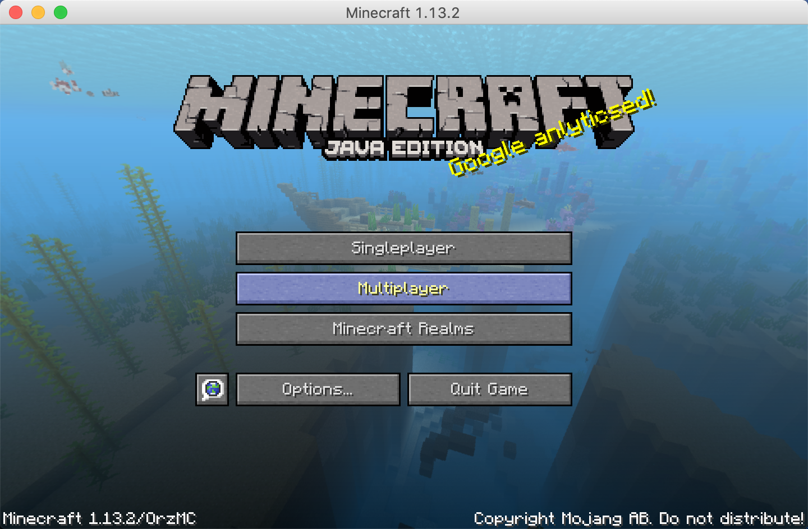
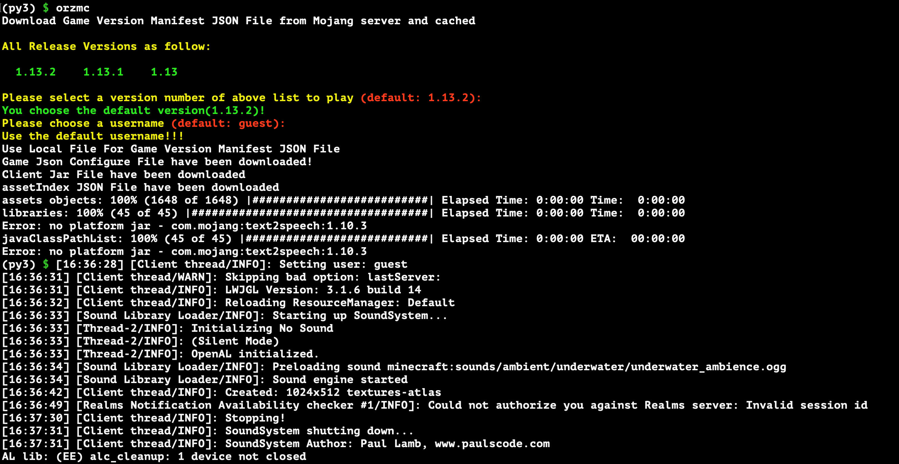

# OrzMC

A tool for deploying minecraft client and server

Only supports Python >=2.7, <4

Requires Java Runtime Environment to be configured!

# Supported Minecraft Client Version

- supports all versions of client

- you should make sure the version of the minecraft server that you will connect to is the same as that of the client.

- This Program has been uploaded into PyPI

# Supported Operating System

- mainly for MacOS.
- Maybe can run on windows, as a backup schema.

# Usage

**You should have a jre runtime on you device**

`orzmc -h` to check the help info

```bash
$ orzmc -h

    NAME

        orzmc -- A command line tool for start minecraft client or deploy minecraft server

    Usage

        orzmc [-v client_version_number] [-u username] [-h]

            -s, --server
                deploy minecraft server, if there is no this flag, this command line tool start minecraft as default
        
            -v, --version  
                Specified the Minecraft clinet version number to start

            -u, --username 
                pick an username for player when start the client

            -t, --game_type
                Specified the type of game: "pure"/"spigot"/"forge" for server, "pure/forge" for client

            -m, --mem_min
                Specified the JVM initial memory allocation

            -x, --mem_max
                Specified the JVM max memory allocation

            -V, --Verbose
                Output some debug info for bugfix

            -h, --help 
                show the command usage info
```

## Run Client



### run the client normally with latest version and default username

```bash
$ pip install orzmc
$ orzmc
```


### if you know the client version and your username

```bash
$ pip install orzmc
$ orzmc -v 1.13.2 -u player_name
```

## Deploy Server

### use default setting to deploy the pure server

default set jvm initial memory alloc `512M`, and max memory alloc `1024M`

```bash
$ pip install orzmc
$ orzmc -s
```

### you can specify the initial memory and max memory alloced for the jvm with options `-s` and `-x` to run the minecraft server

```bash
$ pip install orzmc
$ orzmc -s -m 512M -x 2G -v 1.13.2
```

### you can also deploy the spigot/forge minecraft server with option `-t`

#### Spigot Server

```bash
$ pip install orzmc
$ orzmc -s -t spigot -m 512M -x 1G -v 1.13.2
```

#### Forge Server

```bash
$ pip install orzmc
$ orzmc -s -t forge -m 512M -x 1G -v 1.13.2
```

---

The game resources are saved under user's home directory, and named `.minecraft`

# Tips

This is not a game for one player, so you should invit someone you like to make you guys own beautiful world!!!

# TODO List

- [x] add Spigot Server deploy option
- [x] add a homepage for this project
- [ ] add world backup function
- [ ] refine the project script for readable
- [ ] automation the process of installing JDK/JRE Runtime
- [ ] add some unit test case to guarantee quality
- [ ] create a Docker Mojang Mirror Server for personal CDN 

# Reference

- [SpigotMC](https://www.spigotmc.org/)

# Videos

- [A Brief Introduction for the project](https://youtu.be/gx-JeoW2K5I)
